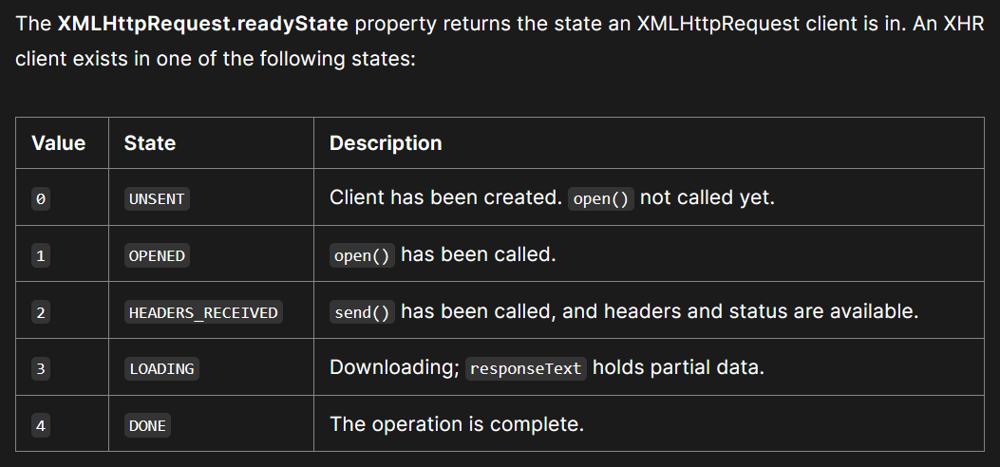

Legacy XHR

XMLHttpRequest (XHR) objects are used to interact with servers. One can retrieve data from a uniform resource locator without having to do a full page refresh.

Promise

The Promise object represents the eventual completion (or failure) of an asynchronous operation and its resulting value.

